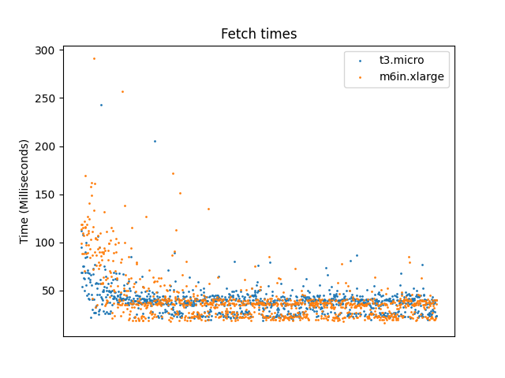

# S3 Benchmarks
This project benchmarks the performance of fetching parts of a large file from AWS S3. There are two binaries in the project: bench and populator. The populator uploads a file with random bytes to an S3 bucket. The size of the file and the bucket name is configured in [pkg/common.go](pkg/common.go).

## Run instructions
### Benchmark
In order to run the benchmark, you can run\_test.sh file after providing a role with access to AWS S3 in ec2\_cf.yaml. Replace the name `S3Ec2Access` with the name of your role under `TestInstanceProfile`. After this, when you run the run\_test.sh file, the following steps are taken to generate test results:
1. An ec2 instance is created using cloudformation.
2. The benchmark file is copied over to the instance.
3. The benchmark is run and the results are copied over to local machine.
4. The ec2 instance is deleted by removing the cloudformation stack.

### Populator
In order to run the populator, you can run `go run cmd/populator/main.go`. As mentioned in the introduction, you may need to configure the parameters in [pkg/common.go](pkg/common.go).

## Results
These are the results from one of the runs:
| Metric | T3.nano      | M6In.xlarge |
| -----  | -----------  | ----------- |
| min | 19  | 16 |
| max| 243 | 291  |
| avg | 39 | 41  |
In this run, the reads were sequential and therefore we did not see any noticable performance difference.
Following graph shows a scatter plot of fetch times as time progresses:

Initially, there is a lot of variability in the fetch times however, they converge to around 50ms after the first few fetch operations.
